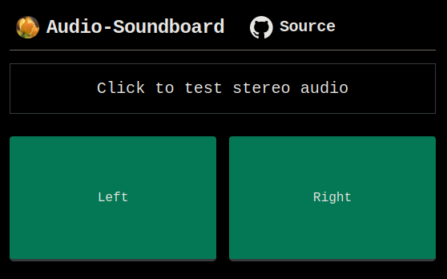

# audio-soundboard

A soundboard app to play stereo audio samples.

Live demo: https://sogladev.github.io/audio-soundboard



The app has two buttons that play audio samples - `left.mp3` in the left channel only, and `right.mp3` in the right channel only.

## Key Features

- Play stereo audio samples
- Simple UI with two buttons
- Hosted on GitHub Pages

## Built with

[](https://skillicons.dev)

- Typescript
- Tailwind CSS
- Vue 3 (Composition API)
- Nuxt

## Setup

```
npm install
```

## Development

```
npm run dev
```

## Deployment

Generate a static site:

```
npm run generate
```

Deploy to GitHub Pages:

```
npm run deploy
```

## Resources

- [Nuxt 3 documentation](https://nuxt.com/docs/getting-started/introduction)
- [GitHub Pages deployment](https://github.com/darioTecchia/nuxt3-ghpages)


```
npm install
```

## Development

```
npm run dev
```

## Deployment

Generate a static site with
```
npm run generate
```

deploy to github pages
```
npm run deploy
```

package.json script
```
    "deploy": "nuxt generate && gh-pages --dotfiles -d .output/public"
```

## Resources

https://github.com/darioTecchia/nuxt3-ghpages
https://github.com/andgyk/anime-soundboard

Nuxt 3 Minimal Starter: Refer to the [Nuxt 3 documentation](https://nuxt.com/docs/getting-started/introduction) for more information.
